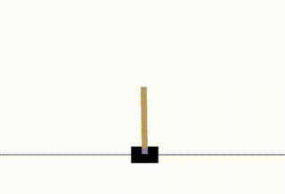

# Self-Play Using Reinforcement Learning (SPURL) - under construction
SPURL is an open-source toolkit for building self-play algorithms to solve reinforcement learning environments. SPURL's modular build allows users to train with SPURL for a variety of self-play, multi-agent or single-agent reinforcement learning problems.

We present a variety of demos to illustrate the functionality of SPURL:

To be added:
TicTacToe/ Noughts & Crosses
Connect Four
Pong
Cartpole
Pendulum
Bipedal Walker
Soccer Twos

| Environment Type | Example (Solved by SPURL) |
| :---        |    :-:   |
|Single-Agent Discrete Actions (Cartpole)|  |
|Self-Play Discrete Actions (TicTacToe)|  |

SPURL currently demonstrates the following functionality:

| Feature      | Support |
| :---        |    ---:   |
| Action Space | Discrete/ Continuous |
| Opponent Sampling | Vanilla/ Ficticious/ Prioritised Ficticious |
| RL Scenarios | Self-Play/ Co-op MARL/ Single-Agent |
| Opponent Experience for Training | Yes/ No |

## Quick Start

Entry-points into SPURL are present in `spurl.core` and may be used to train or test any algorithms.

Please see `demos` for example usage to train or test using self-play environments.
