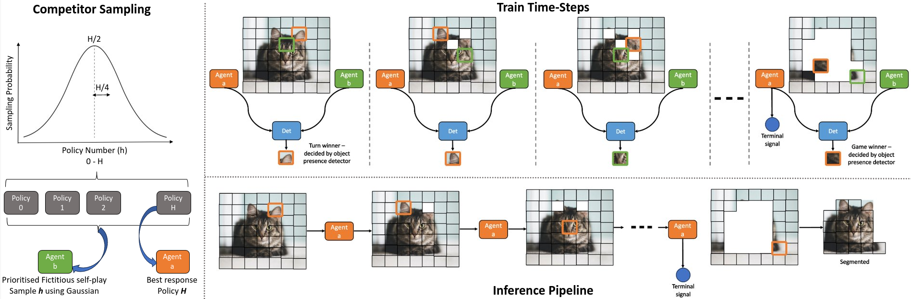
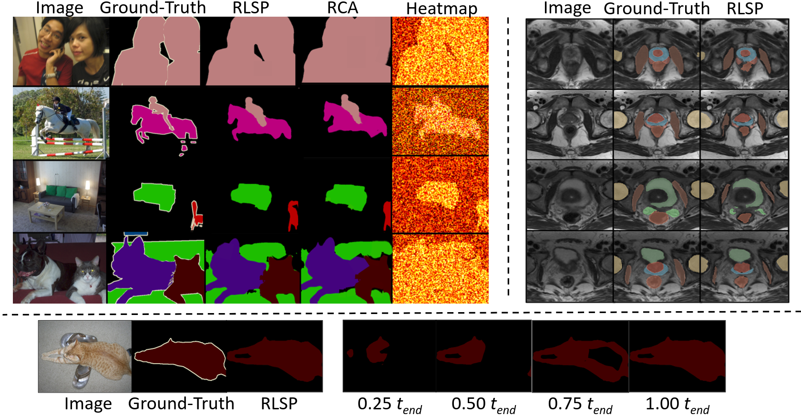

## Competing for pixels: a self-play algorithm for weakly-supervised segmentation

Anonymous authors

This repository presents code for our proposed weakly supervised segmentation (WSS) method that gamifies image segmentation of a region-of-interest (ROI), such that it can be learnt via reinforcement learning (RL) self-play. We formulate segmentation as a competition between two agents that compete to select ROI-containing patches until exhaustion of all such patches. The score at each time-step, used to compute the reward for agent training, represents the likelihood of object presence within the selection determined by an object presence detector. The detector itself is pre-trained using only image-level binary classification labels of object presence. We additionally propose a game termination condition that can be called by either side, upon exhaustion of all ROI-containing patches, followed by the selection of a final patch from each. Upon termination, the agent is incentivised if ROI-containing patches are exhausted or disincentivised if an ROI-containing patch is found by the competitor. This competitive approach to WSS ensures minimisation of over- or under- segmentation, which has thus far been a common problem with WSS methods. 

An overview of our proposed framework is presented below:

Segmented samples for our proposed methods (RLSP) are presented below:

